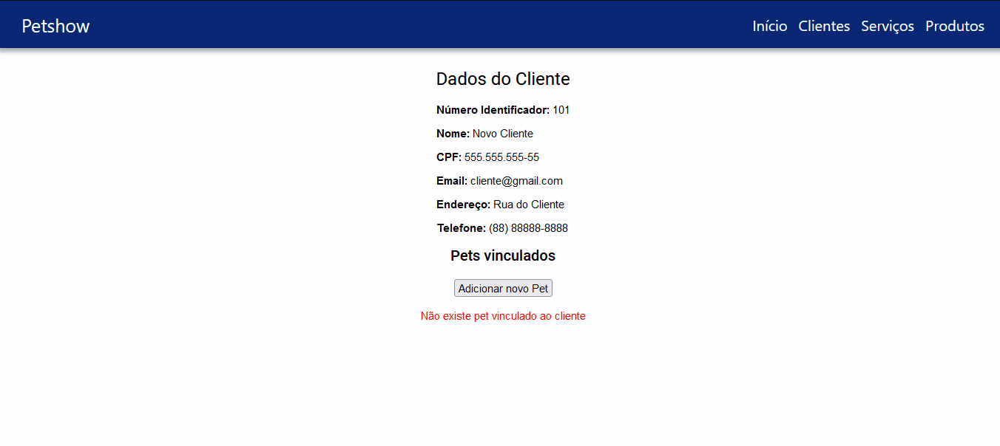
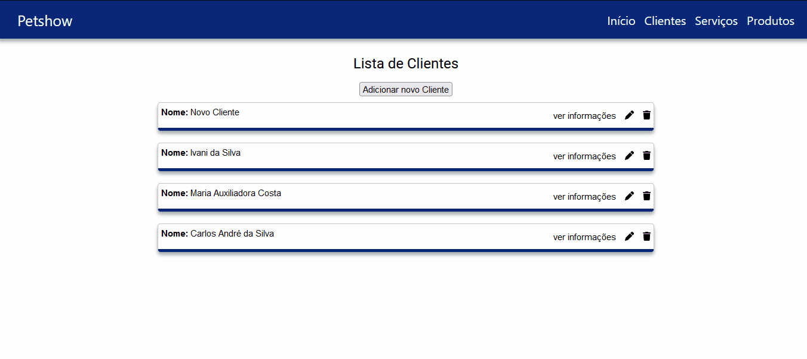

# Projeto PETSHOW

## Link do Repositório BackEnd
  
  [Repositório BackEnd](https://github.com/RamonBatalha/petshow)
 
## Objetivos

- O Projeto tem por objetivo realizar a criação de um sistema de gestão WEB para Petshop 

## Funcionalidades

De início, o projeto terá as seguintes funcionalidades

- Cadastro de clientes e Pets
- Cadastro de Produtos e controle de estoque
- Emissão de nota de serviço

Outras funcionalidades serão adicionadas com o decorrer do projeto

## Ferramentas utilizadas

### BackEnd

- Java e Spring Boot
- Banco de Dados ORACLE

### FronEnd

- Angular

## Funcionalidades Implementadas

- CRUD para cadastro de Clientes com validação de formulários e rotas definidas 
- CRUD para cadastro de Pets com validação de formulários e rotas definidas
- Todos os dados são armazenados no Banco de Dados ORACLE
- Adicionada validações de formulário e Mascaras para dados numéricos
- Adicionado a autenticação de usuário com Firebase e configuradas as proteções de rota com o guard

Projeto em desenvolvimento... 👨‍💻👍😁

